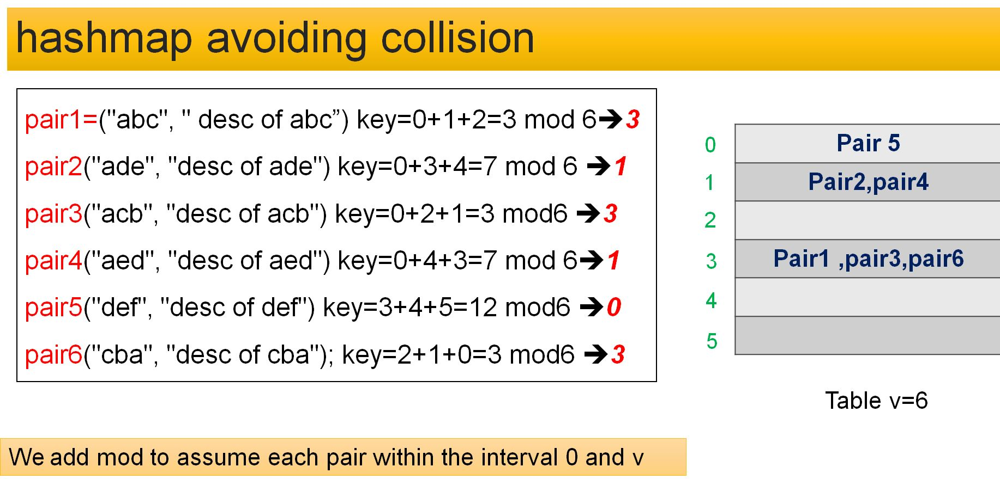

# Hashmap Collision Avoidance Using LinkedList
- We want to store a pair of data {identification, description} in a table with length v by avoiding the collision using a linked-list
- The position of the pair objects is calculated according to the summation order of identification property

  Example pair1={"abc", " desc of abc"}
Key(pair1) =ord(a)+ ord(b)+ ord(c)=0+1+2=3

the proposed data structure is as follows:
- create a static table with a predefined length 
- the content of each cell table is a LinkedList
- the linked list is about a Pair class object
- a Pair object with the two properties identification and description

in this project, we create all required methods to implement this data structure :
- add an element to the table.
- delete an element from the table.
- print the whole table.
- checking if an object exists in the table.
- getting the number of empty slots.

  

  # Time Complexity

- Time complexity to add a pair object is O(1) (keeping track of the last cell of the linked list)
- Time complexity to search an object in worst cases is O(n) (length of the linked list)
- Time complexity to delete an object in worst cases is O(n) (length of the linked list) because we need to find the pair object before deleting.

# video explanation

